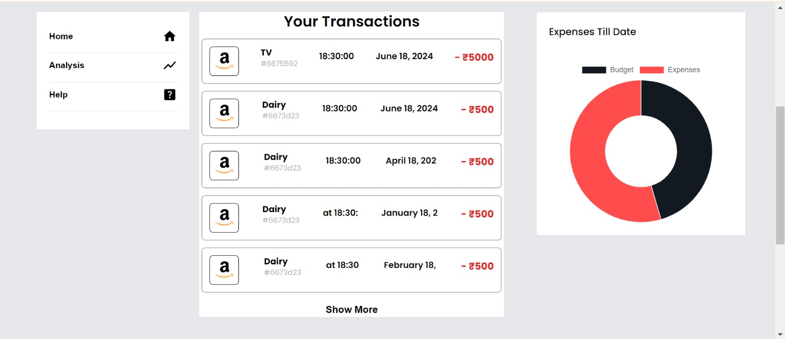

# Amazon Expense Tracker and AI Chatbot

Welcome to the Amazon Expense Tracker and AI Chatbot project! This repository contains the code and resources for an intelligent chatbot integrated with an expense tracker designed specifically for Amazon. The bot can help you keep track of your expenses and assist with various queries.

## Features

- **Expense Tracking**: Automatically track and categorize your Amazon expenses.
- **AI Chatbot**: A smart chatbot that can answer queries about your expenses and provide assistance.
- **PDF Integration**: Load and process expense data from PDF files.
- **Natural Language Processing**: Use NLP to understand and respond to user queries.

## Table of Contents

- [Installation](#installation)
- [Usage](#usage)
- [Configuration](#configuration)
- [Technologies Used](#technologies-used)
- [Contributing](#contributing)
- [License](#license)
- [Contact](#contact)

## Installation

1. **Clone the Repository**:
    ```sh
    git clone https://github.com/yourusername/amazon-expense-tracker-chatbot.git
    cd amazon-expense-tracker-chatbot
    ```

2. **Set Up a Virtual Environment** (optional but recommended):
    ```sh
    python -m venv venv
    source venv/bin/activate  # On Windows use `venv\Scripts\activate`
    ```

3. **Install Dependencies**:
    ```sh
    pip install -r requirements.txt
    ```

4. **Set Up Environment Variables**:
    - Create a `.env` file in the root directory of your project.
    - Add your Google API key to the `.env` file:
      ```env
      GOOGLE_API_KEY=your_google_api_key
      ```

## Usage

1. **Run the Application**:
    ```sh
    python app.py
    ```

2. **Interacting with the Chatbot**:
    - Open your browser and navigate to `http://127.0.0.1:5000`.
    - Use the chat interface to interact with the bot. You can ask questions about your expenses, request reports, and more.

## Configuration

- **PDF Path**: Ensure your PDF files are correctly placed and accessible. Modify the paths in the code if necessary.
- **Google API Key**: Make sure to set up your Google API key in the `.env` file for accessing NLP services.

## Technologies Used

- **Python**: Main programming language.
- **Flask**: Web framework for building the chatbot interface.
- **spaCy**: Natural Language Processing library.
- **LangChain**: For managing the conversational AI components.
- **Google Generative AI**: For generating responses and embeddings.
- **PyPDF2**: For reading and processing PDF files.
- **dotenv**: For managing environment variables.
- 
## Demo




## Contributing

Contributions are welcome! Please follow these steps:

1. Fork the repository.
2. Create a new branch (`git checkout -b feature-branch`).
3. Commit your changes (`git commit -m 'Add some feature'`).
4. Push to the branch (`git push origin feature-branch`).
5. Open a pull request.

## License

This project is licensed under the MIT License. See the [LICENSE](LICENSE) file for details.

## Contact

For any questions or feedback, please contact:

- Your Name
- Email: yourname@example.com
- GitHub: [yourusername](https://github.com/yourusername)

---

Thank you for using the Amazon Expense Tracker and AI Chatbot! We hope it helps you manage your expenses effectively.
